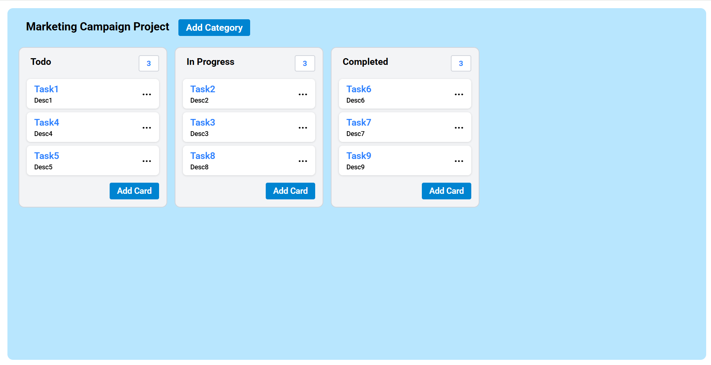
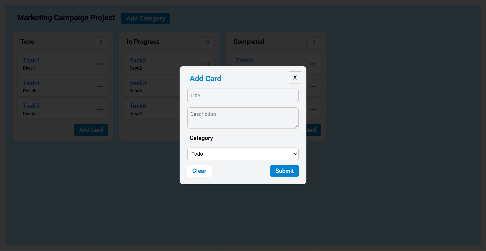
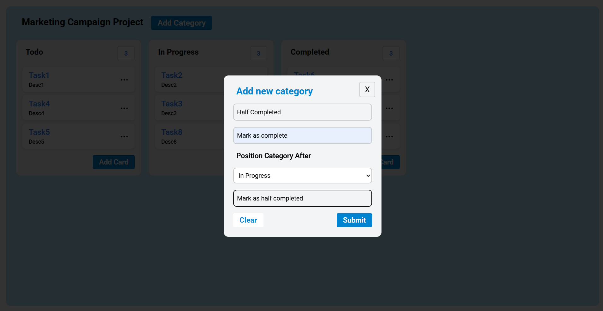
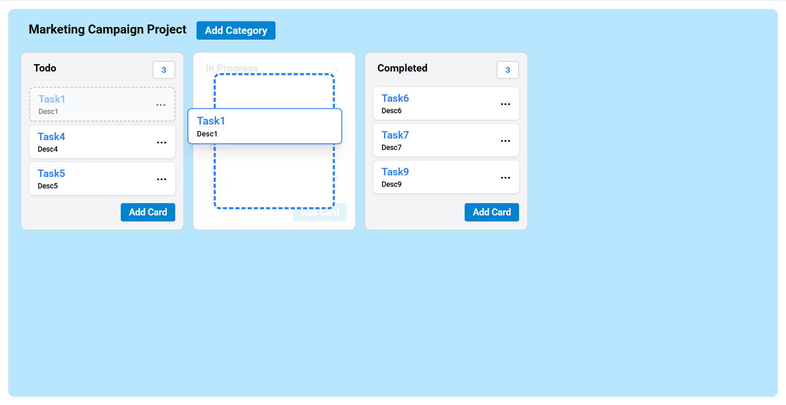

# 📝 Task Manager Board

---

A kanban-style task board built with **React** and **React DnD**, supporting:

- ✅ Drag & Drop tasks between categories
- 🆕 Add/Edit Tasks with modals
- 🗂️ Create new categories dynamically
- 🧲 Custom drag preview for tasks
- 📦 Modular, maintainable codebase

---

## 🚀 Features

---

### 📦 Task Management

---

- Add/Edit tasks with title, description, and category
- Real-time updates reflected across the board

### 📤 Drag & Drop (powered by `react-dnd`)

- Move tasks between columns
- Visual drag preview follows the cursor

### ➕ Category Management

- Dynamically add new categories
- Insert category at specific position
- Define custom "Next Phase" and "Previous Phase" texts

### 🧠 Custom Hooks

- `useOutsideClick`: Detects outside clicks to close modals

---

## ✨ UI Preview










---

## 📁 Folder Structure (Simplified)

src/

├── App.tsx # Main application component

├── components/

│ ├── TaskCategory.tsx # Column/category component

│ ├── TaskItem.tsx # Individual task card

│ ├── AddCategory.tsx # Category creation

│ ├── DragPreview.tsx # Custom implementation of the preview of content when dragging

│ ├── CustomTrelloModal.tsx # Task modals

│ └── custom-hooks/

│ └── useOutsideClick.tsx # Custom hook

└── App.css # Base styles

---

## 🛠️ Tech Stack

- **React 19+**
- **TypeScript**
- **Tailwind CSS** for styling
- **React DnD** for drag and drop
- **Custom Hooks** for modal behavior

---

## Code Architecture Highlights

1.  **Type Safety:** Comprehensive TypeScript interfaces for all data structures

2.  **Performance Optimizations:**
    -- Memoized callbacks with useCallback
    -- Efficient state updates with immutable patterns

3.  **Accessibility Considerations**: Clear visual feedback for drag operations

## 🧪 Run Locally

```bash
git  clone  https://github.com/akshitjain3/trello-board.git
cd  task-manager-board
npm  install
npm  run  dev
```
